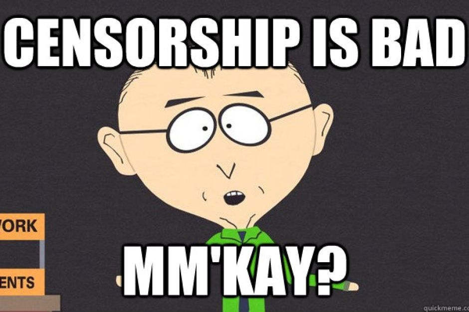

## The Story

Last week I was on my vacation in Dubai (UAE). It was a great vacation. The weather was hot - usually around 35-38 °C. For me (who loves hot weather) it was great. I did enjoy those tropical nights at the hotel. I like to relax and in the evening by watching some movie or favorite show while drinking a cold drink. Since I run plex at home server but I don't have plex open to the Internet I need a VPN. So if I want to watch movies outside my home network - I need to connect to a home VPN. I was so glad that the hotel had fast but unsecured WiFi. I thought that shouldn't be a problem. I have my own tools for that! Well... _It was_. And it was much worse than I thought.

## The problem

So I tried to connect to VPN. At first, it seemed fine but I was _wrong_. Nothing worked. I had VPN status on the device so there was contact with my server however I was not able to get any data through a secure tunnel. Nothing. And of course, it wasn't the router's fault. Without VPN everything worked as it should be.

And at that moment it was clear for me. I am in a country that blocks VPN. Wow. Probably with DPI (deep packet inspection). When the government and ISP discover that packets going through their firewall seems like encrypted data like VPN they just block them. That's why I was able to connect to my VPN server but wasn't able to get any data through.

_Damn._ Suddenly I was the victim of censorship. No free Internet. No movies, shows, or _porn_ (UAE's specialty).




Normally I would use SSH to connect home and I would just open or forward some ports. Hell, I could even try to create a SOCKS5 proxy tunnel to get through that damn firewall. But no. I forgot to save the public key ssh key of my shell in `allowed_hosts`.

I would like to note that all I had was my iPad and on iOS it's very complicated to forward ports or use socks5. I think I found some app for this specific. However, I decided to give up on ssh solution to get out.

Plus for security reasons I don't allow password ssh login from the Internet. I allow the only login via ssh key.

Meaning I was literally _screwed_.

## What next?

Although it was a pain in the ass (_yes_) when I think about it today I think it was suddenly a great challenge for me to get somehow behind that firewall and get _free_ internet again.  What is interesting though is that there are multiple countries where is VPN allowed only for the government. Such countries are:

* China
* Russia
* Turkey
* Iran
* Oman
* UAE

So instead of watching movies, I started working on getting through.

I did try every well-known public VPN service on the App store (I had only iPhone and iPad with me) or websites. But no go. I tried TOR same as VPN. I was able to connect but was unable to get any data through. I found a project called `stunnel` which encrypts data and sends them through any TCP port. Basically secure proxy. I could have used this to hide VPN. But I needed jailbreak for the iPad so it wasn't an option.

## Solution: Shadowsocks

So after some digging through forums such a Hacker-news I've found it. Tool called `Shadowsocks`. Made by Chinese hackers (thanks guys) to bypass GFW ([Great China Firewall](https://en.wikipedia.org/wiki/Great_Firewall)). This tool hides VPN in TLS packets and sends them through TCP port by choice. So it's more like an advanced proxy. But it's a perfect tool for this kind of situation. BTW funny thing was that even the home page wasn't blocked.

_Anyway._

I needed VPS since I was without a server so I chose AWS lightsail for easy deployment. I set up a quick Debian instance with opened 443 port. Then I logged in and double-checked I had root rights and installed Shadowsocks.

### 1. Installation

```bash
pip install shadowsocks
```

Then for a quick setup, I did run this service in the background.

```bash
sudo ssserver -p 443 -k password -m aes-256-cfb --user nobody -d start
```

Thanks to root rights I was able to run this on port 443. Then I needed to set up my client. I had found an application for an iPad called [Outline](https://apps.apple.com/us/app/outline-app/id1356177741). I installed it and selected the option to add a new server.

### 2. Setup

You need to fill access key. That's `ss://` URL. Filling the address might be tricky. I tried several times yet I was getting error message - `Invalid access key`_._  _Yuck_. In the end, I had to encode the URL into BASE64 (you case use this tool on [shadowsocks site](https://shadowsocks.org/en/config/quick-guide.html) - bellow) and after that, I was finally able to add a new server.

### 3. Test

After you try to connect to Outline it asks you for permission to install a new VPN profile on your device. For iPad, it works like a VPN you can see the VPN logo in the top menu bar when you are connected. And at that moment I eagerly opened the browser and tried _pornhub.com_ (UAE blocks all porn sites) and I had finally **free** Internet.


## End

While this wasn't that difficult to set up I can tell you that at first, it seemed impossible to somehow get through the firewall. I only had an iPad and IPSEC protocol which wasn't working. The number of solutions I tried was a lot.

Funny thing is that when I bypassed ISP and finally I had free internet that evening something strange happened. Police arrived at the hotel since I saw police sirene light from my balcony. I was basically hacking, or doing what was against law. And not that enough suddenly at night something seemed like a drone **flew** over my position. I was a little bit paranoid and immediately hide inside. I thought.

_They are after me!_

Luckily they did not. The next day army was supposed to have a parade or something (as the local said) and I think the police were just checking the location including the nearby hotel if everything is alright. But I'll be honest and I can tell that I was a little bit nervous at the moment.

---

That's it. I hope you enjoyed my little story. Remember that shadowsocks ❤️ is your tool if you visit the country where ISP blocks many services such as VPN.
