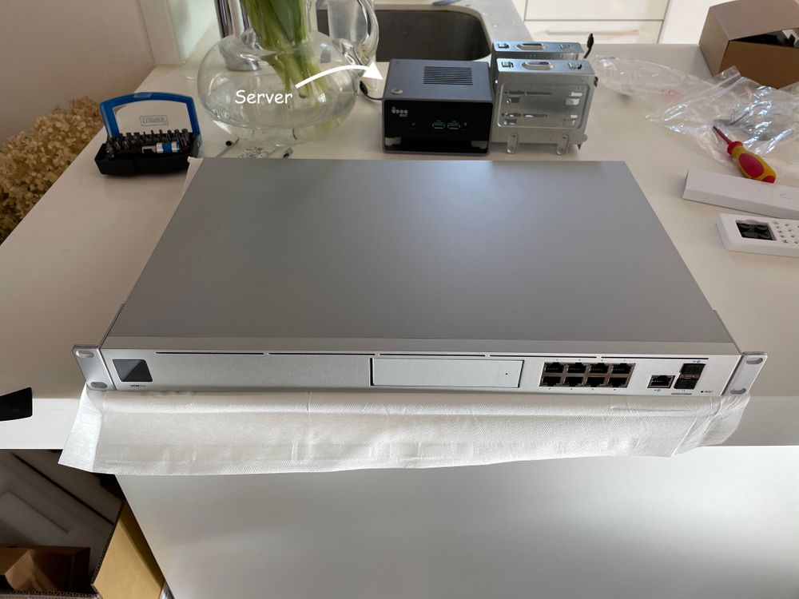
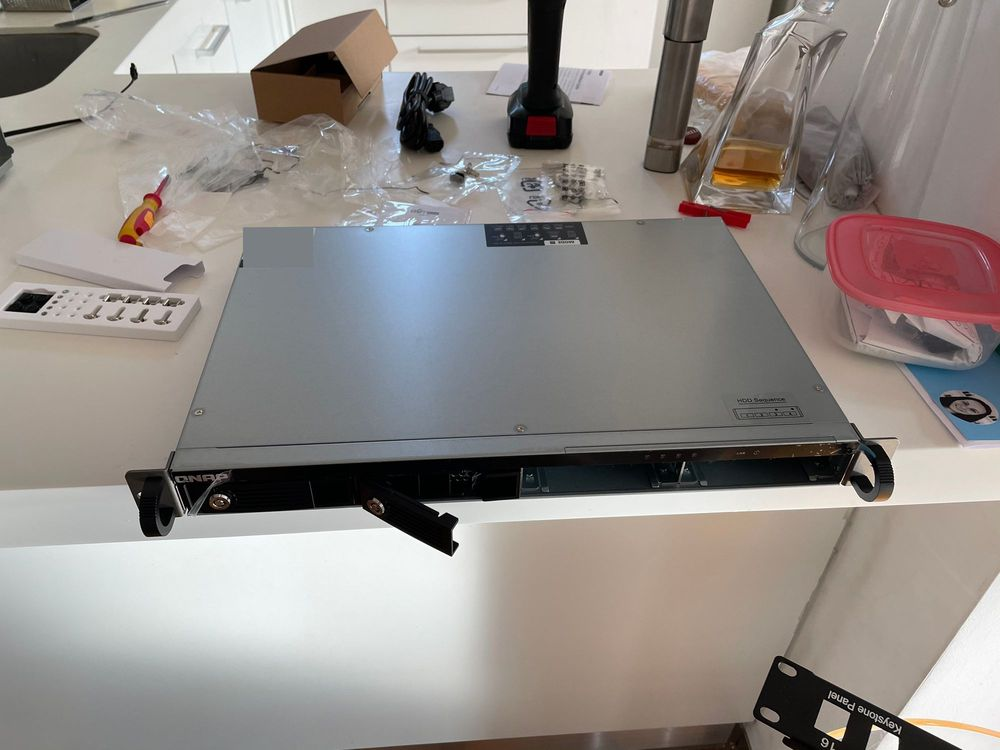
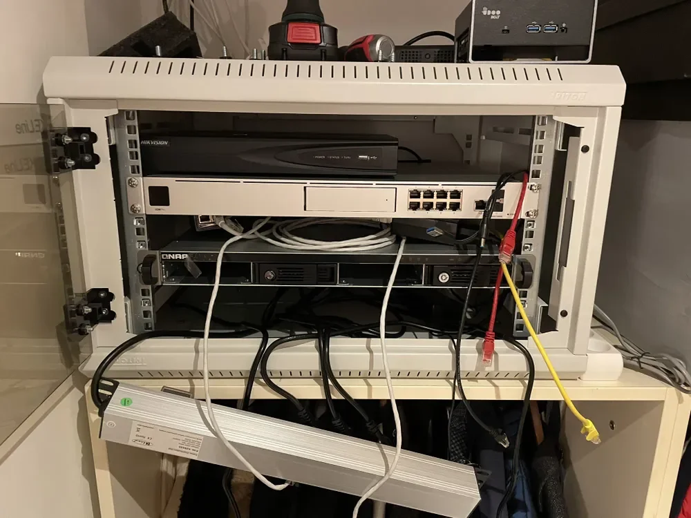
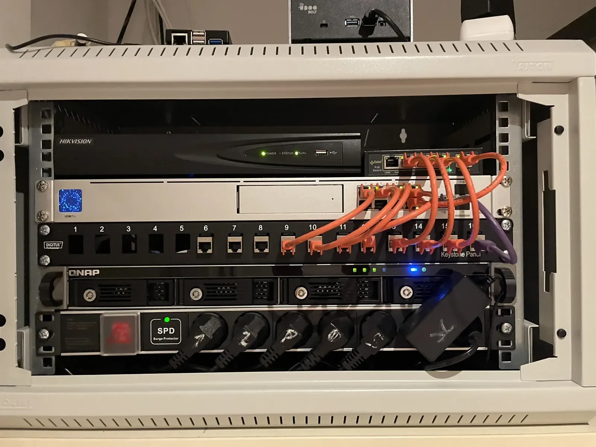
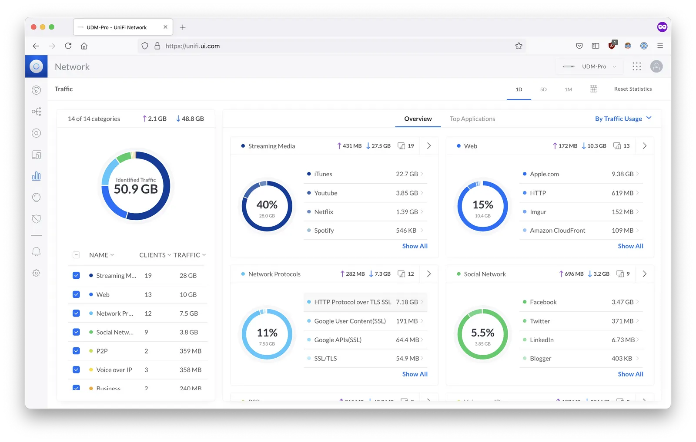

Building and maintaining home lab is my hobby. Creating one allows you to experiment with hardware, software, and networking, while empower self-hosting which opens you whole new world with infinitive possibilities. And when you create one you with many services, you can also share them with friends. Hosting services like plex for watching movies or hosting a minecraft server. By self hosting stuff, you can gain great expericence, freedom, friends but also responsibility. A great way to start your career!

## Where do we start?
If you are planning to build your own home lab you can find (as I did) lot of info in reddit's communities like `r/homelab`, `r/sysadmin`, and `r/selfhosted` serve as valuable resources, providing knowledge, inspiration. There are also many discord servers like `k8sathome`, `sysadmin`, `ubuiqity` and many more which contain supportive network of fellow enthusiasts.

Now about my setup. There are some closed sourced technologies both SW and HW, but overall most of the stuff is FOSS. Tools like proxmox, ubuntu, btrfs, etc. I think that the biggest advantage using them is the community. Blogs, discord channels, reddit posts and many more can be great source of knowlage when trying to understand how to use them. I always like to choose technology where can I find active users who communicate and share knowledge but also help each other. Funny is that even unifi biggest and most helpful support I found (again) is the unofficial channel.

But enough of that and let's get to my homelab. While working on my home setup the biggest challages were:

* small space, small rack (I cloud not purchase classic server with depth 60cm or more)
* noise (room was pretty close to the bedroom)
* again small space so heat issues
* did I mention a small space?

So to beat these challenges I had to make several choices. I could not afford a classic server because of depth of my rack so I decided to go with something like a single-board computer (like a raspberry pi) but more powerful like Intel NUC (AMD fans dont' worry and read more!) .

## Issue 1: Server

The first problem was - which hardware to go with. I could go with Raspberry pi as 80% people who selfhost stuff, _or_ my fancier and go with Intel's Nucs. But I decided to choose a different brand!

_Mmmm_

Honestly at the time I was working on this project AMD was on hype. Of course I would fell for such thing and that's why I made chioce with the Udoo BOLT V8 (link is [here](https://duckduckgo.com/?t=ffab&q=udoo+bolt+v8+&ia=web)). Brand is Bolt and it has nothing to do with audi v8 _haha._  I could go with intel who had bad PR or with AMD Ryzen. Bolt wasn't just any computer. It was the only SBC (single board computer) at the on market what used AMD processors with Vega graphics. I though that cool let's go with it. Nothing bad can happen.

Was it a good option? Yes and no. It's complicated.

Yes is that this processor has enough processing power that I had no problem running all my services so far I do host without any problem and it's not that power-hungry.

No is that AMD's graphic processors do have still some issues on Linux. So here you can Intel or Nvidia better choice. It's not perfect yet but I am sure AMD will issue these problems in near future. Another problem was with fan. There was firmware issue with fan that he was running either 0% or 100% of power. It was so annoying that this machine was for serveral second quiet and suddenly fan was running full power. Luckily company made a patch a BIOS update. And after this update everything was fine. I recommend to anyone be carefull with what you choose because it can be a board without future support with broken firmware can be useless.  Luckily for me thing went fine.

Bolt as a single server machine was fine choice I think after a 1 of usage. But today I would go probably rather with server HW that would support IPMI or iLO or any similar technology.

## Issue 2: Storage

Another issue I had was to deal with the storage. This was a problem from begging of my homelab. I always I had an issue with full storage. One disk wasn't enough, after I bought second one it full really fast. And then I did not have enough USB, SATA III ports on my machies.I knew I needed more disks in my lab for more data, but I didn't want a NAS. What choice I did then?

[DAS](https://en.wikipedia.org/wiki/Direct-attached_storage) (which stands for _direct-attached storage_). DAS is a much more simple technology than NAS. Very similar to NAS but with much fewer features. It's basically just a case for disks attached that could be attached to computer, NAS or to a server. No disk encryption but it supprots HW raid or mainly JBOD.

And this was what I exactly wanted. I wanted an _option_ to add more disk (at least 4)  for my lab to expand the storage. And NAS with custom OS seemed overkill to me.

So instead NAS, I use SATA and USB-C and JBOD. Disks are connect to QNAP via SATA. Then whole DAS is connect via USB-C to a server and finally servers sees all disks via JBOD (just a bunch of disks) technology.

#### So DAS but what OS and raid?

For raid, I went with a software solution even though QNAP DAS has support for hardware RAID. My choice was the `btrfs`. I could go with `ZFS` but that's primary for enterprise ( you need 1GB memory for 1TB of storage) but also you can't add to the existing pool another disk which was a deal-breaker for me.

`Btrfs` is the solution for Linux, you can add more disks later. However btrfs still has issues and linux community doesn't find btrfs very stable. There are issues with raid 5,6 are not recommended to use. In short, using RAID 6 gives you more storage to use. I found project callend`Stratis` but this one seems still young technology I culd not find large community. Let's hope that `Bcachefs` will be the linux FOSS future!

#### Custom NAS

In my opinion, most NAS solution these days sucks. They have complicated UI. But they work. So if you want a magic box that is plugged and working goes with NAS. Or you can create one and customize it based on your needs. All you need is some SBC like rock64 (it has 1gbps ethernet port and 4GB ram) and direct storage like QNAP DAS. Connect them via USB, install Linux, then btrfs, and finally NFS and voilà you have NAS.

This way I can have a software-controlled raid (which is better than hardware controlled one).  Raid is a great thing but remember it's not a backup!

## Issue 3: Network

You need a network e.g. WIFI router to connect to the Internet for your server and for your home network. And that's it.

_However_, you can go fancy like me and go with UDMP (Unifi dream machine pro). It is a network tool that is a switch, router, security gateway, and cloud key in one machine. Cool right!

There are _soo_ many things you can do with this machine! For me using this machine was such a great boost. I can set up VLANs networks, I can control bandwidth for every AP, I can set up firewall rules, I can use DPI to control what network users are doing, I can block p2p, I can setup IPS to control security, I can set up honeypot in case someone does something funny.

There is so much I can do with this machine and it's not that expensive for what it does. Give it try. I thought this was a perfect machine until something bad happened.

In December 2020, company Ubiquiti was compromised thanks to one employee that who didn't set up 2FA for his AWS s3 cloud account. The whole s3 bucket, which allegedly contained all privates keys and more secure sensitive linked to every running UDM pro in the world, was _compromised_.

---


**Update!** 2021 December

The culprit behind that massive leak was caught. And to my surprise, it wasn't any hacking group. It turns out it was one of very high-ranking employees who had full access to everything.

