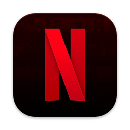

Recently I had the privilege to try Netflix (I know it's 2021 but I used plex and jellyfin for that) and I was surprised that there is no _native_ app for the mac.

My other surprise was that I could not find any simple tutorial how to setup Netflix using `nativefier`. So I decided to create this post and hopefully this one will save you some time.

## Wait what nativefier?

In case you never heard before about `nativefier` is a command-line tool to _easily_ create a desktop app for any web site with minimal configuration. Basically ala electron app but not in brower but in app. For netflix it's much for me easier to have it in sepearate app than brower. _Anyway_.



## What do you need?

There is not _that_ much needed:- nativefier (Can be installed via homebrew) - python3 (To sign the app) - Netflix icon (Credit and link for the gorgeos icon. Source: [octaviotti](https://www.deviantart.com/octaviotti/art/Netflix-for-macOS-718469466))


<!--  -->

## Building the netflix app

First create a folder e.g. netlfix-build. Then create file `netflix.css` and fill it with code:

```css
/* site.css */

/* netflix header is draggable */
.pinning-header {
-webkit-app-region: drag;
padding-top: 20px;
}

/* but any buttons inside the header shouldn't be draggable */
.secondary-navigation {
-webkit-app-region: no-drag;
}

```

After that, run inside this folder following command:

```bash
nativefier --enable-es3-apis --icon Netflix\ Alt.icns --browserwindow-options\
'{ "fullscreenable": "true", "simpleFullscreen": "false"}' --darwin-dark-mode-support\
--background-color '#36393f' --title-bar-style hiddenInset --inject\
netflix.css --name 'Netflix' --widevine  'https://netflix.com'
```

After couple of seconds you should see another folder called Netflix-darwin-arm64 (your could be different based on your CPU architecture). Don't go inside this folder otherwise the signing the app will not work.

## Code signing the app

To sign the app you have to use EVS castlabs package. There are three simple steps to do that.

First install evs package:

```bash
python3 -m pip install --upgrade castlabs-evs
```

Register account (if you don't want to use your personal account I recommend to use this [site](https://mytemp.email)):

```bash
python3 -m castlabs_evs.account signup
Signing up for castLabs EVS
 - A valid e-mail address is required for account verification
>> E-mail Address []: me@example.com
>> First Name []: Me
>> Last Name []: Example
>> Organization []: Example, Inc
>> Account Name []: example
>> Password []: XXXXXXXX
>> Verify Password []: XXXXXXXX
Confirming EVS account
 - A confirmation code has been sent to your e-mail address
>> Confirmation Code []: XXXXXX
Discarding authorization token(s)
Refreshing authorization token(s)
```

_And at last_ - sign the app. Just be careful and run the command using directory containing the app and don't pass the app directly otherwise command will fail.

```bash
python3 -m castlabs_evs.vmp sign-pkg ./Netflix-darwin-arm64
```

_But why I have to sign the app?_ Well if you don't sign Netflix app build via _nativefier_ you will not be able to play any stream. Yeah it kind of sucks but I get why Netflix does this. Anyway app is already there you can try to open it and see it for you self that when you click on any show or movie you will get error.

🎉 you finnaly have netflix app on mac. Now which show to watch first?

<!--  -->
